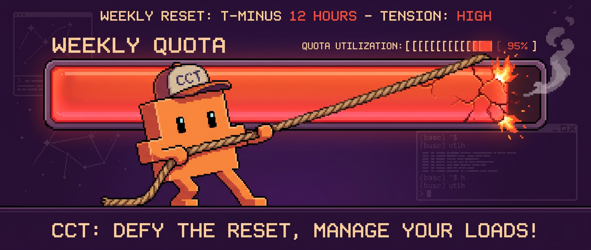
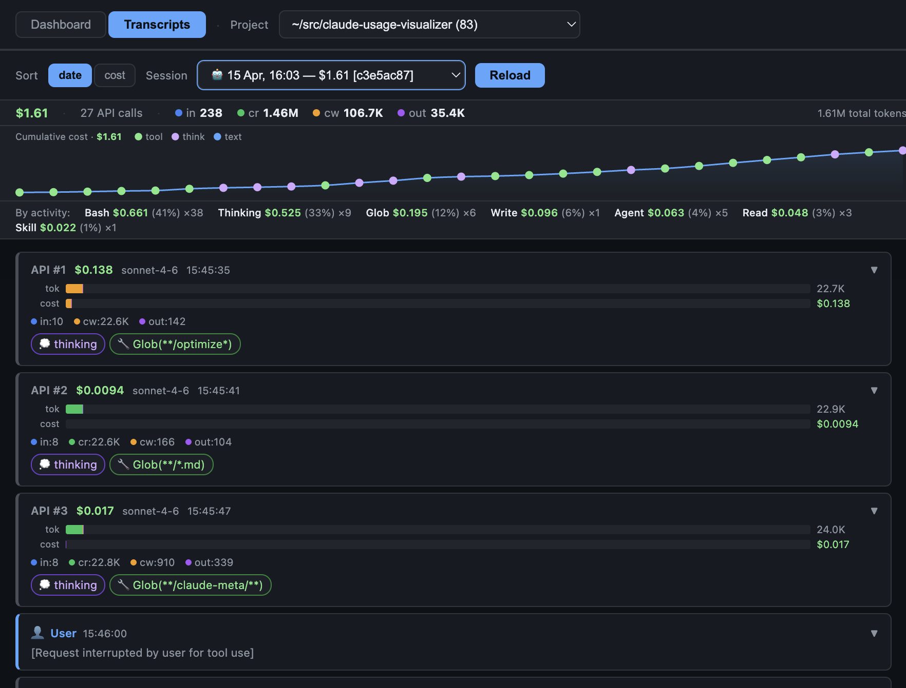
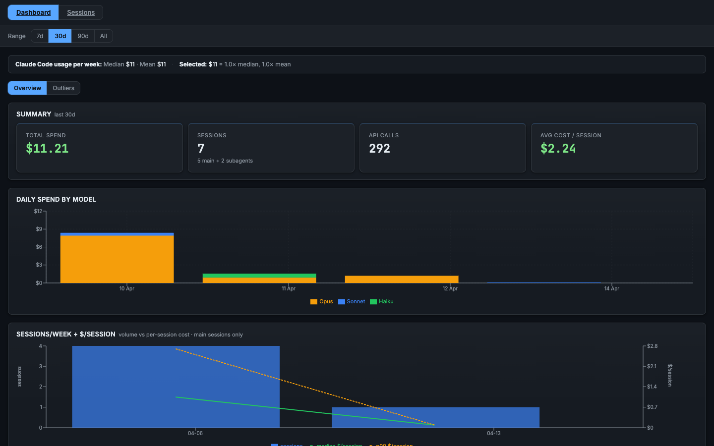

<h1 align="center">cct</h1>

<p align="center">
  
</p>

<p align="center">
  <a href="https://github.com/alfredvc/claude-usage-optimization/actions/workflows/ci.yml"></a>
  <a href="https://github.com/alfredvc/claude-usage-optimization/releases"></a>
  <a href="https://crates.io/crates/claude-code-transcripts-ingest"></a>
  <a href="LICENSE-MIT"></a>
</p>

**Let Claude audit its own bill.** `cct` turns every transcript under `~/.claude/projects` into a local DuckDB. With the provided skills Claude runs SQL over your own history and returns a dollar-ranked optimization report. Actionable insights backed by your own usage, not generic advice.

## Install cct

```bash
curl -fsSL https://raw.githubusercontent.com/Alfredvc/claude-usage-optimization/main/install.sh | sh
```

Downloads the latest prebuilt `cct` binary into `~/.local/bin`. Override with `CCT_INSTALL_DIR=/some/dir` or pin a version with `CCT_VERSION=v0.2.0`.

## Install skills

Install for Claude Code, Cursor, Gemini CLI, etc:

```bash
npx skills add alfredvc/claude-usage-optimization
```

## Quickstart
```bash
cct ingest
```

Claude uses the duckdb cli, follow instructions to install [https://duckdb.org/install/?platform=macos&environment=cli](https://duckdb.org/install/?platform=macos&environment=cli) or

```bash
curl https://install.duckdb.org | sh
```

Then simply ask claude to help you `/optimize-usage`

The skill runs a multi-phase investigation against your own DB: measures spend categories, inspects raw high-cost turns, disconfirms shallow leads, then ranks concrete levers by dollar impact. 

## Available skills

- **claude-usage-db** — gives the agent everything it needs to query the transcripts DB safely: schema layout, sidechain/subagent model, JSON column shapes, billing-safety rules, and a library of ready-to-run SQL recipes for cost, token, tool-use, and session analysis.
- **optimize-usage** — diagnostic methodology for turning the DB into actionable cost recommendations. Guides the agent past shallow category rollups toward root causes (artifact propagation, context bloat, workflow cycles) with phase gates that prevent premature victory declaration. Built on top of `claude-usage-db`.

## Commands

### `cct ingest`

Scan JSONL transcripts and write a DuckDB database.

```
cct ingest [-i <dir>] [-o <file>] [-j <jobs>] [--pricing <toml>] [--no-progress]
```

| Flag | Default | Meaning |
|---|---|---|
| `-i, --input-dir` | `~/.claude/projects` | Directory scanned recursively for `.jsonl` |
| `-o, --output` | `./transcripts.duckdb` | Output DuckDB file (overwritten each run) |
| `-j, --jobs` | `0` (logical CPUs) | Parallel worker threads |
| `--pricing` | — | TOML overriding the seeded `model_pricing` table |
| `--no-progress` | — | Silence per-second progress on stderr |

### `cct serve`

Serve the embedded viewer backed by a DuckDB file.

```
cct serve [--db <file>] [--port <n>]
```

| Flag | Default | Meaning |
|---|---|---|
| `--db` | `./transcripts.duckdb` | DB file to serve |
| `--port` | `8766` | Listen port |

#### Transcripts

Browse by project → session → turn-by-turn timeline. Every assistant turn shows its exact cost: input, output, cache-read, and cache-creation tokens with the resulting dollar amount. Subagent calls expand inline so you can trace the full cost of any delegated task back to the turn that triggered it.

<p align="center">
  
</p>

#### Dashboard

Shows total spend, daily cost by model (Opus / Sonnet / Haiku), cache hit rate, agent model inheritance (subagents that silently fell back to Opus), top sessions by cost, file hotspots (files re-read across the most sessions), and error cost premium.

<p align="center">
  
</p>

## Workspace

```
crates/claude-code-transcripts/              # typed parser library (no DuckDB)
crates/claude-code-transcripts-ingest/       # `cct` binary (ingest + serve)
crates/claude-code-transcripts-ingest/web/   # embedded React viewer (index.html)
skills/                                      # agent skills (see above)
```

The parser crate ([`claude-code-transcripts`](https://crates.io/crates/claude-code-transcripts)) is independently usable — strongly-typed `Entry` variants and a round-trip validator for catching schema drift.

## Development

- `cargo build` — build workspace
- `cargo test` — unit + integration tests
- `cargo clippy --all-targets --all-features`
- `cargo fmt`
- Pre-commit hook (`.git/hooks/pre-commit`) runs `fmt` + `clippy`

## License

Dual-licensed under [MIT](LICENSE-MIT) OR [Apache-2.0](LICENSE-APACHE).
