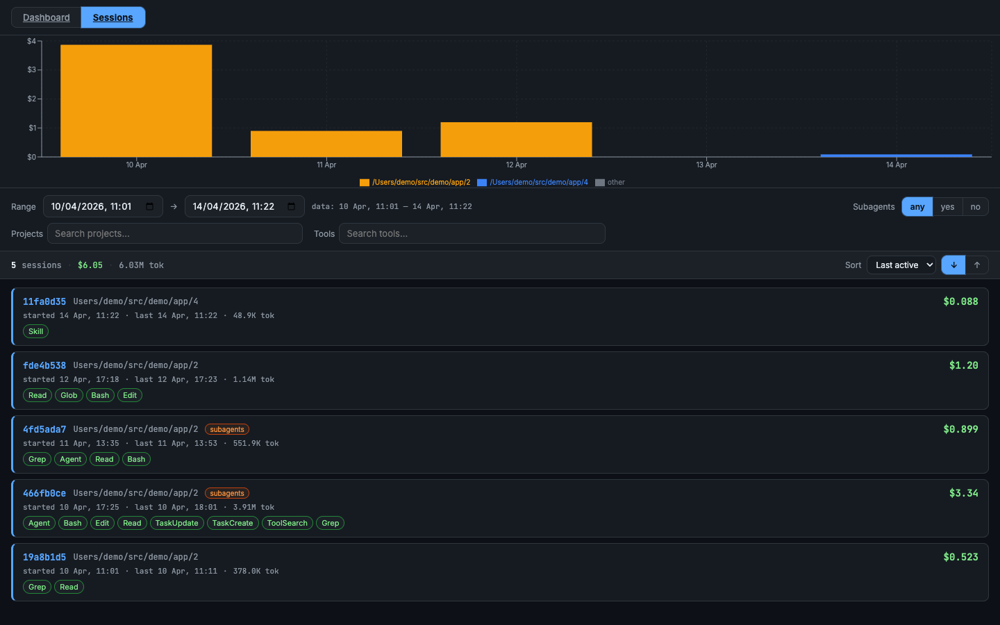

<h1 align="center">Claude Usage Optimization</h1>

<p align="center">
  
</p>

<p align="center">
  <a href="https://github.com/alfredvc/claude-usage-optimization/actions/workflows/ci.yml"></a>
  <a href="https://github.com/alfredvc/claude-usage-optimization/releases"></a>
  <a href="https://crates.io/crates/claude-code-transcripts-ingest"></a>
  <a href="LICENSE-MIT"></a>
</p>

**Let Claude audit its own bill.** Agent skills that turn every transcript under `~/.claude/projects` into a local DuckDB, then let Claude run SQL over your own history and return a dollar-ranked optimization report. Actionable insights backed by your own usage, not generic advice.

Skills pair with `claude-code-transcripts-ingest` (`cct`), the Rust binary in this repo that ingests your transcripts into DuckDB.

## Install

### 1. Skills

Install for Claude Code

```bash
npx skills add alfredvc/claude-usage-optimization
```

### 2. `cct` (required)

```bash
curl -fsSL https://raw.githubusercontent.com/Alfredvc/claude-usage-optimization/main/install.sh | sh
```

Downloads the latest prebuilt `cct` binary into `~/.local/bin`. Override with `CCT_INSTALL_DIR=/some/dir` or pin a version with `CCT_VERSION=v0.2.0`. Source: [`crates/claude-code-transcripts-ingest/`](crates/claude-code-transcripts-ingest/).

### 3. DuckDB CLI (required)

Skills query the DB via the `duckdb` CLI. Install from [duckdb.org](https://duckdb.org/install/?platform=macos&environment=cli) or:

```bash
curl https://install.duckdb.org | sh
```

## Quickstart

```bash
cct ingest
```

Then ask Claude `/optimize-usage`.

The skill runs a multi-phase investigation against your own DB: measures spend categories, inspects raw high-cost turns, disconfirms shallow leads, then ranks concrete levers by dollar impact.

## Tips
If you have any hypothesis as to what could be consuming your usage, ask Claude, it is excellent at testing them with cct.

## Available skills

- **claude-usage-db** — schema and SQL recipes so Claude can query the transcripts DB efficiently.
- **optimize-usage** — gives Claude the tools to investigate your usage and return concrete, dollar-ranked fixes to reduce it. Built on `claude-usage-db`.

## Explore sessions in the viewer

`cct serve` opens an embedded web viewer at `http://localhost:8766`. Pick a project → session to drill in turn-by-turn.

- **Per-turn cost.** Each assistant turn shows model, timestamp, and dollar cost — with input / cache-read / cache-write / output split as colored bars against the session total.
- **Activity at a glance.** Pills tag what the turn did: thinking (💭), text (💬), tool calls (🔧). An activity panel rolls up cost and call count per tool so the budget-eaters stand out.
- **Subagent expansion.** Subagent calls expand inline and lazy-load their full transcript, so you can trace delegated work — and its cost — back to the parent turn that spawned it.
- **Cumulative cost chart.** Area chart above the timeline plots spend over the whole session. Click any dot to jump to and highlight that turn.
- **Session rollup.** Fixed header shows total cost, API call count, and token totals by type.
- **Sort by cost or date.** Session list can sort by most recent or highest spend, so expensive sessions float to the top.

The **Dashboard** tab shows a multi-panel cost breakdown split into two sub-tabs:

- **Overview** — general spend picture: daily spend by model, sessions/week, token-type cost split, model breakdown, errors.
- **Outliers** — actionable panels: most-expensive turns, top sessions, context-size distribution, cache invalidation events, artifact leaderboards, file hotspots, and more.

<p align="center">
  
  <br/>
  <em>Session list — sortable by cost or time, filter on project, tool, model, subagents.</em>
</p>

<p align="center">
  
  <br/>
  <em>Session view — per-turn cost, cache/token split, tool calls and thinking inline.</em>
</p>

<p align="center">
  
  <br/>
  <em>Dashboard — daily spend by model, sessions/week, outlier turns.</em>
</p>

## `cct` reference

Full `cct` reference can be found in [`crates/claude-code-transcripts-ingest/README.md`](crates/claude-code-transcripts-ingest/README.md).

## Workspace

```
crates/claude-code-transcripts/              # typed parser library (no DuckDB)
crates/claude-code-transcripts-ingest/       # `cct` binary (ingest + serve)
crates/claude-code-transcripts-ingest/web/   # embedded React viewer (index.html)
skills/                                      # agent skills (see above)
```

The parser crate ([`claude-code-transcripts`](https://crates.io/crates/claude-code-transcripts)) is independently usable — strongly-typed `Entry` variants and a round-trip validator for catching schema drift.

## Development

- `cargo build` — build workspace
- `cargo test` — unit + integration tests
- `cargo clippy --all-targets --all-features`
- `cargo fmt`
- Pre-commit hook (`.git/hooks/pre-commit`) runs `fmt` + `clippy`

## Release

Releases are driven by [`cargo-release`](https://github.com/crate-ci/cargo-release) locally and the tag-triggered [`release.yml`](.github/workflows/release.yml) workflow in CI.

1. On `main`, bump the shared workspace version:

   ```sh
   cargo release patch --execute    # or minor / major
   ```

   Per [`release.toml`](release.toml) this bumps `Cargo.toml`, commits `chore: release vX.Y.Z`, tags `vX.Y.Z`, and pushes both.

2. Pushing the `vX.Y.Z` tag triggers [`release.yml`](.github/workflows/release.yml), which:
   - Creates a draft GitHub release with auto-generated notes.
   - Builds `cct` binaries for linux/macos × x86_64/aarch64 and uploads tarballs + `.sha256` files.
   - Publishes `claude-code-transcripts`, then `claude-code-transcripts-ingest`, to crates.io.
   - Flips the release from draft to published.

Requirements: `cargo install cargo-release` locally, write access to push tags, and the `CARGO_REGISTRY_TOKEN` repo secret configured.

## License

Dual-licensed under [MIT](LICENSE-MIT) OR [Apache-2.0](LICENSE-APACHE).
